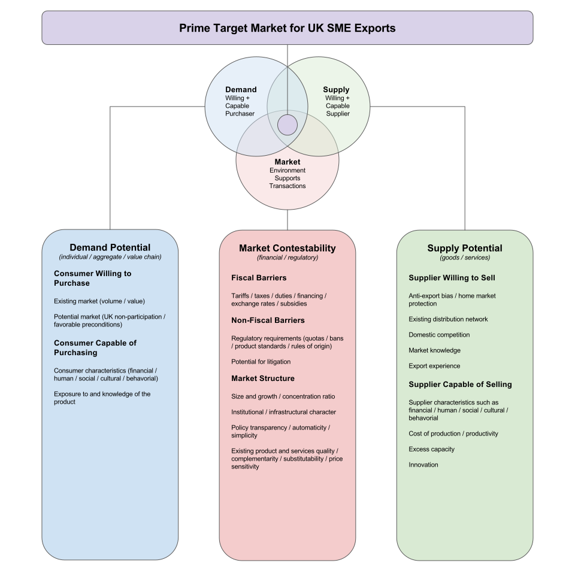
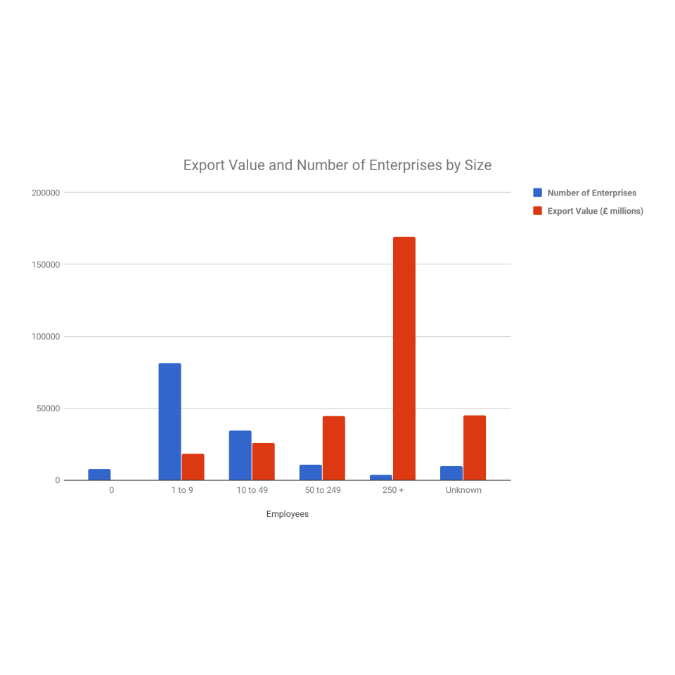
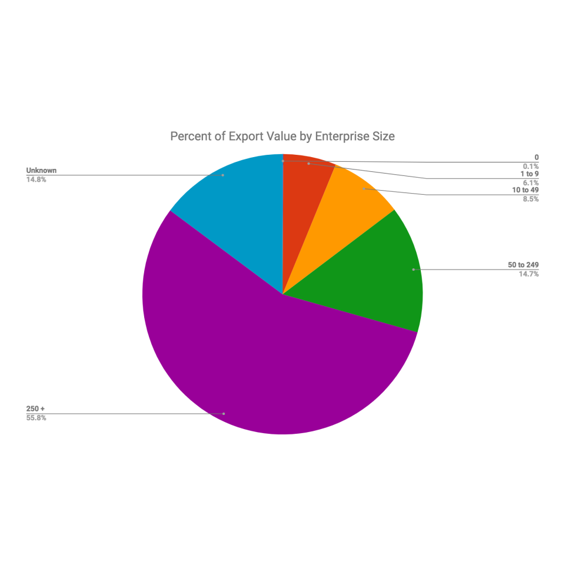
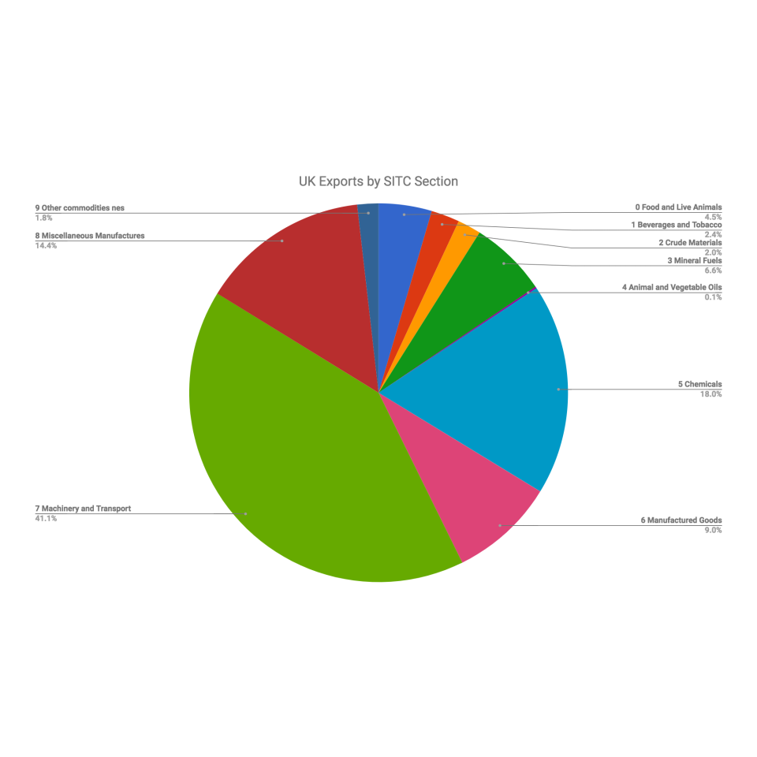
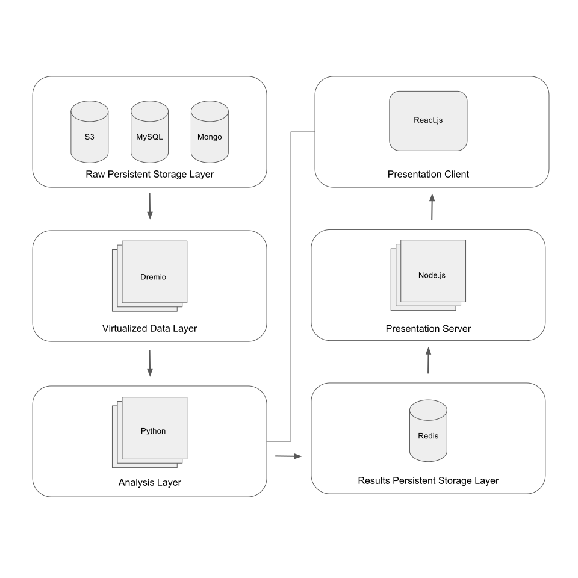

# Project Proposal

## Title

* **Name**: Cameron Porter

* **Class**: 2016

* **Title**: *Identification of United Kingdom Export Markets Post-Brexit via Systematic Weak Signal Analysis*

* **Advisors**: Christopher M. Moretti & Gregory E. van der Vink

## Motivation and Goal

* On June 23, 2016, in what has come to he known as the *Brexit Referendum*, the United Kingdom (UK) voted to leave the European Union (EU) [(HM Treasury, 5)](#treasury-brexit).

* The effect of Brexit on the UK's trade and economy is one of the most pressing debates as we approach the final day of UK's membership in the EU, March 29, 2019.

* There is a consensus in the academic community that in the long run, Brexit will have a negative effect on trade, although the extent of the effect is uncertain [(Sampson, 164)](#sampson-brexit).

* The purpose of this project is not to analyze the economics of Brexit.

* The purpose of this project is to design a systematic way of quantitatively analyzing potential markets for UK products in order to optimize the UK's Department of International Trade's effort to boost UK net trade in the face of a seemingly inevitable decline.

* Our goal is to design an automated *weak signal analysis* system, capable of dynamic data augmentation, for identifying markets for up to five UK products/services in the United States (US).

## Problem Background and Related Work

### Economics of Brexit

> Academics, private firms, and government agencies have weighed in on the economics of Brexit. Overall, the analysis focuses on two aspects of Brexit: what will be the macro level effects on the UK's economy, and what is the desired nature of relations between the EU and UK post Brexit.

* [(HM Treasury)](#treasury-brexit)

* [(Carl)](carl-brexit)

* [(Sampson)](#sampson-brexit)

* [IMG Forum Expert Panel Survey on Brexit I](http://www.igmchicago.org/surveys/brexit-2)

* [IMG Forum Expert Panel Survey on Brexit II](http://www.igmchicago.org/surveys/brexit-ii)

* In terms of small and medium size enterprises (SMEs), the UK's share of exports is in the bottom five across Europe [(WorldFirst, 5)](#worldfirst-brexit).

* One of the primary factors deterring UK SMEs from exporting is a sense that their product or service will not be suitable for a particular market [(WorldFirst, 6)](#worldfirst-brexit).

* Although it may be assumed that a weakening pound will increase exports, the global nature of UK supply chains combined with the potential for increased tariffs means exporters could become less competitive [(WorldFirst, 12)](#worldfirst-brexit).

* Due to the price inelasticity of UK goods and services abroad, quality and brand are two of the most important factors in determining SMEs' export success [(WorldFirst, 12)](#worldfirst-brexit).

* More than half of SME exports go to the US [(WorldFirst, 16)](#worldfirst-brexit).

* "SMEs in the IT and Communications sectors are much more likely to have plans to export (23% had such plans). Similarly, across the Professional and Scientific Service industries, 11% of SMEs said that they have such plans. This still leaves a considerable number of businesses across the UK with no intention to export" [(WorldFirst, 19)](#worldfirst-brexit).

## Approach

> We will be proposing an ecosystem approach with big data analytics. We will create a conceptual framework. That conceptual framework will be translated into a taxonomy that allows us to organize logically the analysis. Algorithms will be generated based on the conceptual framework and taxonomy. The analytical approach is designed to be iterative and continue to be refined as we learn more and evaluate performance.

### Conceptual Framework

> The challenge of improving UK exports is extremely well-suited to big data analytics. It is the type of of problem that defies a single solution and is characterized by a myriad of dynamically interconnected variables. It occurs in complex systems, where causal relationships are not always direct, and where the circumstances vary from location to location. While such problems may defy linear approaches, outcomes can be predicted. We predict outcomes through an "ecosystem" approach – a holistic approach that parameterizes the ecosystem and allows for predictive modeling.

* With Brexit on the doorstep, it appears that a decline in net trade is imminent. Offsetting that decline by developing strategies to increase exports from SMEs is a major focus of the UK and in particular its Department for International Trade. However, current strategies are insufficient to address the problem.

* Current strategies to identify target markets for UK products abroad have focused on ad hoc surveys, reports, and data collection by trade agents from the Department for International Trade.

* These techniques are not only expensive, but insufficient. They do not leverage a holistic approach that seeks to address the problem using an ecosystem model.

* "Every market and enterprise has a complex mosaic of characteristics derived from the demographics, environmental resources, geographical location, economic activity, socio-cultural landscape, etc. that define a unique environment.  These characteristics are reflected in census data, transactions, survey data, remote imagery, and many other datasets.  While these datasets may be of varying quality and completeness, each has the potential of carrying information that reflects potential for a given product in a given market, either by itself, or more commonly through combination with other datasets." [Novametrics, 1](#novametrics-trafficking)

* "New methodologies in big data analytics hold promise for exploiting these existing diverse data sets. In many areas, we are no longer data limited.  We can go beyond the resolution of traditional data analysis, identifying diagnostic “signals” in what was previously considered “noise,” to improve estimates of prevalence, identify underlying causal relationships, and optimize return on investment (ROI)" [Novametrics, 2](#novametrics-trafficking)

* There are *five V's* of big data: volume, velocity, variety, variability, and value [(Jain)](#jain-data).

* Weak signals are a phenomenon of ecosystems with many interacting parts. Observing these ecosystems and performing weak signal analysis requires ingesting diverse streams of data and then systematically looking at how these data streams interact with one another to produce strong predictive indicators.

  * *Strong signals*, by contrast, arise from a single source.

* The result of our weak signal analysis will be a suite of indicators, no one of which is predictive of our desired output, but in combination provide valuable insight.

* Our approach to identifying markets for UK products focuses on quantitative rigour and weak signal analysis to create ecosystem level insights.

* Quantitative rigour will be achieved by extracting salient features from data via established algorithms such as *Principle Component Analysis* (PCA) and *Non-Negative Matrix Factorization* (NMF). Clustering algorithms can also be used to identify interesting shared characteristics across markets. Using *correlation matrices* of these features with output variables, sets of features from disparate data sources can be integrated into a single indicator quantitatively.

* Unlike other methodologies that focus on the volume/value of data, we will be focusing on using data from a variety of sources (satellite imagery, amount of bike friendly lanes, number of Starbucks, average income, etc.). From this variety, we will inevitably find proxy measures that though not causal, are nonetheless predictive of what we are interested in.

* Much like in *ensemble learning* where a set of *weak learners* are used in conjunction to produce a strong model, we believe that by integrating weak signals from a variety of data sources, we can eliminate noise to capture subtle but powerful indicators. These indicators would otherwise be overlooked by methodologies not focused on the complex interplay that creates the salient characteristics of ecosystems.

* In order to effectively carry out this methodology, we must recognize that we are no longer data limited, but analysis limited. However since the methodology is quantitative, we can design systems to carry it out on our behalf.

* The system we design will have three key features.

  1. It must be able to operate on a variety of data sources simultaneously as if they were a single source.
  1. It must be able to carry out feature extraction and weak signal analysis.
  1. It must be able to dynamically integrate new data sources.

* Using a variety of data sources, weak signal analysis, and an automated system, we hope to be able to create heat maps identifying potential markets for UK products.

  * The raw output of our methodology will be a probabilistic value best represented as a confidence interval

### Analytical Approach

> The application of weak signal analysis to big data is used identify characteristics predictive of outcomes, and to reveal underlying causal relationships. The weak signal approach to big data finds inter-relationships among multiple variables. With many variables and many distinct markets, there may be multiple independent linkages. Multiple independent linkages indicate the potential value of a market has multiple causes; and the causes have different relative priority in different locations. Previously hypothesized relationships may be confirmed, but unexpected relationships are more common. It is the unexpected relationships that lead to a more sophisticated understanding, and in turn, offer opportunities for more effective market identification. [Novametrics, 6](#novametrics-trafficking)

* Identifying target markets can be classified as a wicked problem - the type of problem that defies a single solution and is characterized by a myriad of dynamically interconnected variables [(Novametrics, 2)](#novametrics-trafficking)

  * The original use of the term "wicked problem" is attributed to design theorist Horst Rittel.

  * "Examples of “wicked problems” include reducing poverty, stopping outbreaks of civil violence, and mitkigating natural disasters.  Wicked problems occur in complex systems, where causal relationships are not direct, and where the circumstances that foster the problem vary from location to location." [(Novametrics, 2)](#novametrics-trafficking)

* The concept of data stacking is important for understanding weak signal analysis. It is illustrated by the two astronomical images in the figure following. The picture on the left is a single image. The picture on the right is the combination of 27 images of the same object – mathematically stacked one on top of the other. The composite of 27 images provides greater resolution and therefore a more accurate picture than any of the single images.   In data processing terminology, we are able to amplify the “weak signals” and suppress the “noise”. The weak signals (small-scale physical features of the planet) are present in the individual images but they cannot be seen because of the blurriness of the picture. The blurriness, or noise, is caused by atmospheric refraction, vibrations of the telescope, etc. and varies randomly in each of the images. When 27 of the images are stacked upon each other, the random noise cancels itself out and the signals co-add among the images.  The result is an enhancement of the signal relative to the noise [(Novametrics, 15)](#novametrics-trafficking).


* This capability will allow evaluations in either direction. It can be used to match optimal markets to specific UK goods or services; or it can be used to identify optimal UK goods or services for specific markets.

* For the purposes of this thesis, however, we illustrate the ability to identify prime markets in the US for UK exports.

  * This narrows the focus of the algorithm by eliminating the need to focus on the supply potential.

### Taxonomy

> This section lays out the components of our methodology in a schematic form. These components can be evaluated quantitatively and assigned a value. The schematic taxonomy can be translated into an algorithm and represented with a mathematical expression for market opportunity.

* The taxonomy provides a framework for understanding the factors that create a market system, which can be used to identify target markets for UK products.



* For the purposes of this study, a market system can be described with three factors.

  * *Demand potential* encapsulates the market's consumers willingness and capability of purchasing the given product or service.

  * *Market contestability* encapsulates the market's fiscal, legal, and regulatory characteristics that either advantage or disadvantage the given product or service in the given market.

  * *Supply potential* describes the market's suppliers willingness and capability of selling the given the product or service to consumers.

* The positive intersection of these three factors can be assumed to represent a market opportunity for a UK product or service.

### Algorithm

> The schematic taxonomy can be translated into an algorithm and represented with a mathematical expression. This section describes that mathematical expression.

* Let $\alpha$ be a given product or service.

* Let $O_{\alpha}$ be the market opportunity for a given product or service $\alpha$.

* Let $D_{\alpha}$ be the demand potential for a given product or service $\alpha$.

* Let $S_{\alpha}$ be the supply potential for a given product or service $\alpha$.

* Let $M_{\alpha}$ be the market contestability for a given product or service $\alpha$.

* Factors are multiplicative, as a reduction of any factor to zero (e.g. removing it entirely) reduces the potential value of the target market to zero.

$$O_{\alpha} = D_{\alpha} * M_{\alpha} * S_{\alpha}$$ (1)

* Each of the factors contain multiple terms. These terms are additive.

* Let $t$ be a certain time period.

$$D_{\alpha}(t) = f_{D}(\text{volume} + \text{volume} + ...)$$ (2)

$$M_{\alpha}(t) = f_{M}(\text{tariffs} + \text{taxes} + ...)$$ (3)

$$S_{\alpha}(t) = f_{S}(\text{bias} + \text{distribution} + ...)$$ (4)

* We can now define market opportunity as the following:

$$O_{\alpha} = \int w(\tau_2 - \tau) \sum_{\alpha} D_{\alpha}(t) * M_{\alpha}(t) * S_{\alpha}(t) \text{ dt}$$ (5)

### Simplification

> Our [product selection methodology](#product-selection) allows us to simplify our algorithm. Since the methodology focuses on enterprises already exporting to US markets, we can focus on optimizing for demand potential.

* The selection methodology allows us to assume that the market structure factor is a positive value because the product has met the financial, legal, and regulatory burdens to enter the US markets already.

* The selections methodology allows us to assume the supply potential factor is a positive because the product is already being supplied to US markets.

* This means that we can simplify our algorithm to the following, where $\gamma$ is a positive constant representing market structure and supply potential:

$$O_{\alpha} = \gamma_{\alpha}D_{\alpha}$$ (6)

* We will use our analysis to develop a methodology for identifying markets that optimize for the terms constituting demand potential (volume, value, ...).

* This simplification will allow us to tell UK enterprises which markets to target and why.

### Correlation Analysis

> In our holistic ecosystem-approach, correlations can indicate predictive relationships. The analysis remains agnostic about the form of the relationship and does not assume correlation implies causation (*“cum hoc ergo propter hoc”*) [(Novametrics, 7)](#novametrics-trafficking).

* Consider two market characteristics `A` and `B`.

  1. The correlation is the result of random coincidence and does not reveal any causal relationships between `A` and `B`.

  1. `A` is “causing” `B`, with the independent variable `A` causing the change in the dependent variable `B`.

  1. `B` is “causing” `A`, with the independent variable `B` causing the change in the dependent variable `A`.

  1. `A` and `B` are both dependent variables, both following an independent market characteristic `C` that has not been measured.

  1. `A` and `B` are part of a larger correlated system with no unique causal factor, that is, no independent variable.

  * This final option is characteristic of “coupled systems” in physics, in which “causality” resides in the linkages between variables. In a fully coupled “holistic” system, no variable is truly independent. Such systems are common in the natural environment.  For example, in atmosphere-ocean interactions that lead to the El Niño and La Niña climate events, there are no dependent vs. independent variables. Atmospheric pressure highs and lows induce winds that push surface seawater, and warm and cool patches of the sea surface induce variations in atmospheric pressure. Neither the atmosphere nor the ocean operates independently of the other. Neither can be taken as the independent variable in a causal relationship. Yet the relationship is unambiguous and allows us to predict both the atmospheric and oceanic effects with high degrees of certainty [(Novametrics, 16-17)](#novametrics-trafficking).

* We assume wicked problems are produced by coupled systems.

### Factor Analysis

> Factor Analysis is used to identify the main factors that contribute to the variability of the data. Weightings for each of the factors are quantitatively determined through regression analysis. Composite measures are developed using indicators identified through the factor analysis with weightings derived from the regression analysis [(Novametrics, 7)](#novametrics-trafficking).

* There are two types of factor analysis [(Novametrics, 17)](#novametrics-trafficking).

  * *Confirmatory analysis* tests a hypothesis that the data can be organized into a number of factors.

  * *Exploratory analysis* derives factors without knowing how many “buckets” they might fall into.

  * We are using exploratory factor analysis, because we do not have a preconceived notion as to how many factors will be most salient in the dataset.  Exploratory factor analysis makes no initial assumptions about existing relationships of the factors.

* If the objective is to represent a large dataset with a just a few indicators, Principal Component Analysis (PCA) can be used to identify the variables that are responsible for the greatest variation in the data. As with the correlation matrix, PCA is in some sense, removing the data that are redundant. PCA assumes that much of the data are correlated.  In fact, if the indicators being used are not correlated, the analysis will not be useful [(Novametrics, 17)](#novametrics-trafficking).

* Factors are based on covariance. A factor is not an indicator. It is based on running covariances on all of the indicators and coming up with the factors that bundle together certain indicators at certain weights.  The factors make up the total variance of all the indicators [(Novametrics, 17)](#novametrics-trafficking).

* The *scree* plot is a two dimensional graph with factors on the x-axis and *eigenvalues* on the y-axis.

  * Eigenvalues represent the variance accounted for by underlying factors.

  * The scree plot is used to select factors that account for the majority of the variance.

* Indicators are extracted from the factors by determining which of the indicators are responsible for the factors selected.

* Weightings for the indicators can be determined through regression. The p-value can be used to determine a weight that represents each indicator's correlation with the outcome.

## Plan

### Product Selection

> In order to test our methodology, we have selected five UK products/services.

* According to the [European Commission on Internal Market, Industry, Entrepreneurship, and SMEs](http://ec.europa.eu/growth/smes/business-friendly-environment/sme-definition_en), an SME is defined as follows:

  1. The staff head count must be below the given number.

  1. Either the turnover or the balance sheet must be below the given number.

| Company Category | Staff Headcount | Turnover     | Balance Sheet |
| :--------------- | :-------------: | :----------: | :-----------: |
| **Medium**       | < 250           | < 50 m euros | < 43 m euros  |
| **Small**        | < 50            | < 10 m euros | < 10 m euros  |
| **Micro**        | < 10            | < 2 m euros  | < 2 m euros   |

* According to the UK's HM Revenue and Customs guidance on [Research and Development (R&D) tax relief for SMEs](https://www.gov.uk/guidance/corporation-tax-research-and-development-tax-relief-for-small-and-medium-sized-enterprises), an SME is any company that meets the following criteria:

  1. Less then 500 staff

  1. Turnover of less than 100 million euros or a balance sheet under 86 million euros.

  * These SMEs can get Corporation Tax relief for expenditure on research and development

* As you can see there are multiple definitions of SMEs. For the purposes of this thesis we are going to be focusing on medium sized enterprises.

  * We will define a medium sized enterprise as one 50-500 employees, and a balance sheet of 10-86 million euros or turnover of 10-100 million euros.

  * We are going to focus on medium sized enterprises for two reasons:

    1. The potential value of small enterprise exports are too small.

    1. Large enterprises are already exporting in large quantities.





* These charts were produced using data from UK's HM Revenue & Customs statistics report [UK trade in goods by business characteristics 2016](https://www.gov.uk/government/statistics/uk-trade-in-goods-by-business-characteristics-2016)

* In order to qualify for selection, these products/services must already be successfully exported to the US.

  * This may seem counterintuitive, but the purpose is to hone the focus of this project.

  * The goal of the project is to identify prime markets for UK products/services.

  * By restricting our selection to those already being exported to the US, we are mitigating the importance of other influential economic and political factors on export success.

    * These factors include quotas, tariffs, and regulatory compliance.

* We would also like to note our reasoning for selecting not only products, but services as well.

  * The purpose of the project is to boost UK's net trade.

  * This can be done by decreasing imports or increasing exports.

  * Since products are often made from imported components, the value in terms of net trade from exporting them is partially offset by the import cost of the components.

  * However, since services have no imported components, exporting them has a *purely* positive effect on net trade.

  <!-- Delete this section if only products are selected -->

* For products already exported to the US via e-commerce, it is important that the benefits of a brick and mortar presence are clearly articulated.

  * Potential benefits include exposure in under penetrated markets and the ability to for potential consumers to test products

* Products/services were primarily identified using the *London Stock Exchange's* ["2017 Report - 1000 Companies UK"](https://www.lseg.com/resources/1000-companies-inspire/2017-report-1000-companies-uk).

* The products selected come from a variety of sectors. The following chart shows relative value of exports by section according the Standard International Trade Classification (SITC).



* This chart was produced using data from UK's HM Revenue & Customs statistics report [UK regional trade statistics: first quarter 2017](https://www.gov.uk/government/statistics/uk-regional-trade-statistics-first-quarter-2017)

* The following list is ordered in terms likely hood to be included in our final analysis.

---

#### [Brew Dog](https://www.lseg.com/resources/1000-companies-inspire-britain/brewdog)

> [Brew Dog](https://www.brewdog.com/) is a craft brewery that sells its beer in its own bars and bottle shops. In 2010 they started "Equity for Punks" and have raised £20 million in crowd funding. In the summer of 2016 they opened a brewery in Columbus, Ohio to bring the beer to people across the US.

* [Food and Drink](https://www.lseg.com/resources/1000-companies-inspire/2017-report-1000-companies-uk/food-drink)

* [Crunchbase](https://www.crunchbase.com/organization/brewdog)

* According to [Craft](https://craft.co/brewdog), Brompton has 395 employees and 24.3 million pounds in current assets as of 2016

---

#### Brompton

> [Brompton](https://www.brompton.com/) is a bike company from London that has been manufacturing their signature foldable bike by hand since 1975. They have also recently produced an electric version of their popular bike.

* [Retail](https://www.lseg.com/resources/1000-companies-inspire/2017-report-1000-companies-uk)

* [Crunchbase](https://www.crunchbase.com/organization/brompton-bicycle)

* According to [Craft](https://craft.co/brompton-bicycle), Brompton has 130 employees and 12.1 million pounds in current assets as of 2016

---

#### Rapha

> [Rapha](http://www.rapha.cc/us/en_US/) is a British cycling gear company focused on high end, high performance products.

* [Retail](https://www.lseg.com/resources/1000-companies-inspire/2017-report-1000-companies-uk)

* 251 to 1000 employees according to [Crunchbase](https://www.crunchbase.com/organization/rapha)

* According to [Craft](https://craft.co/rapha), Rapha has 361 employees and 30 million pounds in current assets

---

#### [Chapel Down](https://www.lseg.com/resources/1000-companies-inspire-britain/chapel-down)

> [Chapel Down](https://www.chapeldown.com/) raised crowd funding expectation when it raised £3.95m in ten days. They offer a world-class range of sparkling and still wines, alongside an award-winning range of Curious beers and ciders.

* [Food and Drink](https://www.lseg.com/resources/1000-companies-inspire/2017-report-1000-companies-uk/food-drink)

* As of fiscal year 2016, Chapel down had 8.5 million pounds in total assets according to [Craft](https://craft.co/chapel-down-group)

---

#### [Belvoir Fruit Farms](https://www.lseg.com/resources/1000-companies-inspire/2017-report-1000-companies-uk/food-drink/belvoir-fruit-farms)

> [Belvoir](https://www.belvoirfruitfarms.co.uk/about-us/) make a range of premium soft drinks that are handmade and bottled on the farm using as many UK ingredients as possible. Exports around the world currently account for around 16% of their sales.

* According to [Craft](https://craft.co/rapha), Belvoir Fruit Farms has 50 employees

* [Food and Drink](https://www.lseg.com/resources/1000-companies-inspire/2017-report-1000-companies-uk/food-drink)

---

#### [Monica Vinader](https://www.lseg.com/resources/1000-companies-inspire/2017-report-1000-companies-uk/retail/monica-vinader)

> [Monica Vinader](https://www.monicavinader.com/us/stockists/uk) is a UK based jewelry brand known for the their high quality at a reasonable price point. THey are looking to expand globally into brick and mortar stores beyond their e-commerce presence. This includes opening a flagship store in New York.

* [Retail](https://www.lseg.com/resources/1000-companies-inspire/2017-report-1000-companies-uk)

* 51 to 100 employees according to [Crunchbase](https://www.crunchbase.com/organization/monica-vinader)

---

#### [Pipers Crisp](https://www.lseg.com/resources/1000-companies-inspire/2017-report-1000-companies-uk/food-drink/pipers-crisps)

> [Pipers Crisp](http://www.piperscrisps.com/) was started in 2004 and now sells their locally sourced potatoes in 30 countries world wide. They invest heavily in new equipment and attempt to match new chip flavors to emerging trends in consumption.

* [Food and Drink](https://www.lseg.com/resources/1000-companies-inspire/2017-report-1000-companies-uk/food-drink)

---

#### [Fever Tree](https://www.lseg.com/resources/1000-companies-inspire/2017-report-1000-companies-uk/food-drink/fever-tree)

> [Fever Tree](https://www.lseg.com/resources/1000-companies-inspire/2017-report-1000-companies-uk/food-drink/fever-tree) has become the world's leading supplier of premium natural mixers for alcoholic drinks by retail sale value. Today they sell to hotels, bars, restaurants, and cafes in 65 countries. The seek to capture the trend towards "premiumisation". Two thirds of their sales in 2015 came from abroad, with much of that being in the US.

* [Food and Drink](https://www.lseg.com/resources/1000-companies-inspire/2017-report-1000-companies-uk/food-drink)

* 11 to 50 employees according to [Crunchbase](Fever Tree)

---

#### [Golden Bear](https://www.lseg.com/resources/1000-companies-inspire/2017-report-1000-companies-uk/retail/golden-bear)

> [Golden Bear](www.goldenbeartoys.com) produces high quality plush and plastic toys for children. They recently obtained the worldwide rights for a new property that will allow for further export expansion.

* [Retail](https://www.lseg.com/resources/1000-companies-inspire/2017-report-1000-companies-uk)

---

#### [Gtech](https://www.lseg.com/resources/1000-companies-inspire/2017-report-1000-companies-uk/manufacturing-engineering/gtech)

> [Gtech](https://www.gtech.co.uk/) designs and sells cordless appliances including electric bikes. They have 22 million units in 19 different countries since they were founded in 2001.

* [Manufacturing and Engineering](https://www.lseg.com/resources/1000-companies-inspire/2017-report-1000-companies-uk/manufacturing-engineering)

---

#### Creature London

> [Creature London](https://www.creaturelondon.com/content/about) is a British add agency whose tag line is "breaking the rules, in the right way, for the right reasons". Although they do not have any clients currently in US. This could be an interesting service to explore.

* [Creative Industries](https://www.lseg.com/resources/1000-companies-inspire/2017-report-1000-companies-uk/creative-industries)

---

#### the7stars

> [the7stars](http://www.the7stars.co.uk/) is the largest independent media planning and buying agency in the UK. It also already has US clients like the PGA tour and TLC.

* [Creative Industries](https://www.lseg.com/resources/1000-companies-inspire/2017-report-1000-companies-uk/creative-industries)

---

#### [Amplify](https://www.lseg.com/resources/1000-companies-inspire-britain/amplify)

> [Amplify](http://www.weareamplify.com/) are focused on bespoke marketing campaigns that put emotional experiences at center by engaging with culture that people identify with.

* [Creative Industries](https://www.lseg.com/resources/1000-companies-inspire/2017-report-1000-companies-uk/creative-industries)

---

#### [Kromek Group](https://www.kromek.com/)

> [Kromek Group] builds medical imaging, security screening, and nuclear detection devices. They have a built a mobile commercial radiation detection device and have been awarded a sole supplier contract by DARPA (Defense Advanced Research Projects Agency).

* [Manufacturing and Engineering](https://www.lseg.com/resources/1000-companies-inspire/2017-report-1000-companies-uk/manufacturing-engineering)

---

### Datasets

> We have already identified a number of potential data sources from a variety of providers including, Princeton, Kaggle, Amazon, Uber, and the US Government. Each of these datasets has a location attribute. What follows is a selection of them.

* *Data sources* will refer to raw data from a provider.

* *Data sets* will refer to raw data that has been cleaned (eg. normalized, standardized, and/or aggregated).

<!-- TODO: define *Data types* -->

#### Census

> Census data can provide demographic insights useful for geodemographic market segmentation.

* [Sage Stats](http://library.princeton.edu/resource/4453) is a collection of US state rankings on variety of topics.

* [American FactFinder](http://library.princeton.edu/resource/4640) combines data from the US decennial census, the American Community Survey, and more.

* [US Income Tax Data](https://www.kaggle.com/wpncrh/zip-code-income-tax-data-2014) provides data on the income by zip code.

* [US Permanent Visa Applications](https://www.kaggle.com/jboysen/us-perm-visas) provides data on where Visa applications originate.

* [IRS 990 Filings](https://aws.amazon.com/public-datasets/irs-990/) provides data on nonprofit tax filings.

* [Open Address](http://results.openaddresses.io/) provides street names, house numbers, and postal codes that can be combined with geographic coordinates.

* [World Cities Database](https://www.kaggle.com/max-mind/world-cities-database) provides data to convert country and city names to geographic coordinates.

* [Homlessness in the United States](https://www.kaggle.com/adamschroeder/homelessness) provides data on the rates of homelessness in cities.

#### Housing

> The cost of living is an important characteristic of populations.

* [Census of Population and Housing](http://library.princeton.edu/resource/5016) contains useful demographic information.

* [Zillow Rent Index](https://www.kaggle.com/zillow/rent-index) provides data on the median estimated monthly rental price for given areas.

* [AirBnB Listings](http://insideairbnb.com/get-the-data.html) provides data on neighborhoods and rental prices in select US cities.

* [US Gross Rent Statistics](https://www.kaggle.com/goldenoakresearch/acs-gross-rent-us-statistics) provides gross rent data across the US.

#### Trade

> US trade data can be useful in evaluating the effectiveness of our methodology.

* [Wiser Trade](http://library.princeton.edu/resource/4433) is an international trade database that provides data on U.S. exports and imports by customs district and port.

* [City Data](http://library.princeton.edu/resource/title/city-data) provides a city by city guide to product costs and business expenses.

#### Retail

> The retail stores already located in a given city can provide insights into the consumption preferences of the population.

* [Whole Foods](https://www.wholefoodsmarket.com/stores/list/state) is a high end grocery store whose locations tend to be in close proximity to affluent areas.

* [Starbucks Locations](https://www.kaggle.com/starbucks/store-locations) provides insight into the prevalence of Starbucks in US cities.

* [Breweries & Brew Pubs in the USA](https://www.kaggle.com/datafiniti/breweries-brew-pubs-in-the-usa) provides data on the location of breweries.

* [Restaurants on YellowPages.com](https://www.kaggle.com/PromptCloudHQ/restaurants-on-yellowpagescom) provides data on the type and quality of restaurants.

#### Culture

> We can attempt to quantify the culture of cities.

* [Museums, Aquariums, and Zoos](https://www.kaggle.com/imls/museum-directory) provides location data on these entertainment entities.

* [World University Rankings](https://www.kaggle.com/mylesoneill/world-university-rankings) provides data on the location of top universities.

* [TED Talk Locations](https://www.kaggle.com/rounakbanik/ted-talks) provides data on the location of TED events.

* [KickStarter](https://www.kaggle.com/socathie/kickstarter-project-statistics) provides data on where people who seek funding on the platform come from.

#### Energy

> The type and amount of energy consumed can be used to characterize cities.

* [United States Energy Census](https://www.kaggle.com/lislejoem/us_energy_census_gdp_10-14) provides data on the type and amount of energy for locations across the US.

#### Infrastructure

> The quality of infrastructure can provide insight into the cities priorities.

* [Hospital Ratings](https://www.kaggle.com/center-for-medicare-and-medicaid/hospital-ratings) provides data on the quality of health care.

#### Transportation

> Where people go and how they get there are important characteristics that distinguish populations.

* [Uber Movement Data](https://movement.uber.com/cities?lang=en-US) captures the movement patterns of cities around the world.

* [Move Hub Rankings](https://www.kaggle.com/blitzr/movehub-city-rankings) provides data on how easy it is to get around various cities.

* [Airport, Train Stations, and Ferry Terminals](https://www.kaggle.com/open-flights/airports-train-stations-and-ferry-terminals) provides data on the locations of transportation hubs in the US.

* [Amtrak](https://catalog.data.gov/dataset/amtrak-rail-stations-national) provides data on the location of Amtrak terminals.

* [Major Ports](https://catalog.data.gov/dataset/major-ports-national) provides data on the location of major ports in the US.

* [Freight Analysis Framework](https://catalog.data.gov/dataset/freight-analysis-framework-network-national) provides data for modeling freight in US.

* [Navigable Waterways](https://catalog.data.gov/dataset/navigable-waterway-nodes-national-national-geospatial-data-asset-ngda-waterway-nodes) provides data on the location of navigable waterways in the US.

#### Jobs

> Where people work is an important demographic characteristic.

* [Jobs on Naukri.com](https://www.kaggle.com/PromptCloudHQ/jobs-on-naukricom) provides job postings data.

* [US Jobs on Monster.com](https://www.kaggle.com/PromptCloudHQ/us-jobs-on-monstercom) provides job postings data.

#### Political

> Data on politicians, in particular concerning the orientation and the special interest groups they support, can provide useful insights into the nature of their constituency.

* [CQ Congress Collection](http://library.princeton.edu/resource/5062) is database containing roll call votes by topic and special interest group scores.

* [CQ Political MoneyLine](http://library.princeton.edu/resource/5082) provides data on the flow of money through the US political system.

### Indicators

> *Indicators* are arbitrary combinations of attributes from the physical datasets. Indicators are removed if they are judged to have inadequate coverage or are obviously redundant with other indicators that have greater distribution.

* Some example indicators could be "male population as a percentage of total population" or "number of Starbucks per kilometer".

* The indicators that we find most useful will most likely be ratios that adjust for population, gender disparity, income level, and education level.

  * Since many indicators will be ratios adjusting for population density, gender, age, education, and income, it should be possible to programmatically generate these.

* The development of indicators follows an exploratory. As we run our correlation analysis and discover relationships, we likely be inspired to create more indicators. The more indicators we create, the greater the potential for capturing the underlying relationships that drive ecosystem level insights.

* Indicators will be grouped into *buckets*. Some example buckets could be "health", "education", "economics", "infrastructure", "demographics", or "culture".

* Below is an example of a potential indicator's final metadata structure.

  * It should be noted that indicator naming conventions have not yet been established.

```json

{
  "description": "male population age 15-20 per square km (2015)",
  "abbreviation": "m_pop_15-20_per_km(2015)",
  "bucket": "demographics",
  "sources": ["US Census 2015"]
}

```

* The process of indicator creation will be transparent and reproducible.

#### Standardization

> Because the analysis includes comparisons, we “standardize” the data.  For the purposes of our analysis, we refer to standardizing data as providing a common reference. Whenever we have a measure, we determine how that measure should be standardized so that it can be compared from one location to another.  The standardization process may include weightings [(Novametrics, 5)](#novametircs-trafficking).

#### Vectorization

> While the various indicator measures provide a “magnitude” they typically do not provide a “direction.”  We therefore provide a direction to the value based on the how the indicators will be compiled.  In most cases, this step requires adjusting as a reciprocal or an inverse. For instance, high crime rates are considered a negative feature, while high income levels are considered a positive feature.  We might therefore align the direction of the indicator measures by multiplying all values of one of the indicator measures by -1 [(Novametrics, 6)](#novametircs-trafficking).

#### Normalization

> Because our goal is to perform statistical analysis that combines different types of data, we translate the units and scales of the indicators into a common form of measurement by normalizing. If the data present a normal or log-normal distribution, we normalize the data for each indicator using the deviations from the norm. If the data distribution does not follow a normal distribution or exhibits natural breaks, we use percentile ranking or assign values to each grouping [(Novametrics, 6)](#novametircs-trafficking).

* If the data follows a normal distribution, we can normalize the data for each indicator using the deviations from the norm - also called the *Z score*.

### System Architecture

> This distributed system will consist of six layers. Each layer is responsible for one logical component in the data flow. These layers of abstraction allow for individual components within layers to be upgraded or modified without affecting the functionality of other layers. This decoupling allows for different individuals to work such things as data sourcing, indicator creation, algorithmic implementation, and presentation in parallel.



#### Raw Persistent Storage Layer

> The *raw persistent storage layer* is responsible for storing all of the raw data from the various sources listed above.

* This layer consists of many physical datasets in a variety of data sources. These data sources could include *S3*, *MySQL*, and/or *Mongo*. These can be local or cloud hosted.

* This layer will also store data from the businesses on product/service performance in various markets. This data does not have to exist at the offset, but can be incorporated later. This could either be included in the unsupervised learning methodology we call weak signal analysis or used to augment it using supervised learning. This data helps create the feedback loop that ensures that the system is always improving.

* Where possible, physical datasets will be dynamically updated with new data from their source. This could be done via polling the source or webhooks.

* This collection of data is an asset on its own.

#### Virtualized Data Layer

> The *virtualized data layer* is responsible for providing an abstraction layer between the physical datasets and the *analysis layer*.

* Datasets will be *virtualized* using *Dremio's* open source software.

* These *virtual datasets* are the results of queries on the physical datasets as well as other virtual datasets. In all cases the dataset being queried is never modified.

* This layer will perform any data normalization and cleaning necessary for analysis.

* This layer of abstraction means that we gain the dual benefit of the physical datasets being an immutable source of truth and the ability to structure the data optimally for analysis.

* This layer will be where new indicators are created from the physical datasets. These indicators will be stored in a *space*, a logical grouping of virtual datasets in Dremio.

* Dremio provides a *graphical user interface* (GUI) to make the process of creating virtual datasets straightforward.

#### Analysis Layer

> The *analysis layer* is responsible for performing our weak signal analysis.

* This layer will be implemented in *Python*.

* This layer will include our custom weak signal analysis module.

* This layer will leverage such libraries as `pandas`, `numpy`, and `scikit-learn` to perform statistical analysis and machine learning.

* If neural networks are used, they will likely be implemented with `keras`.

* *Jupyter notebooks* will be used to initially explore and implement our methodology.

#### Results Persistent Storage Layer

> The *results persistent storage layer* is responsible for storing the output of our analysis so that it only has to be rerun when either new data is added or the methodology changed.

* The data will be stored with *Mongo* or *Redis*.

#### Presentation Server

> The *presentation server* will be responsible for providing the *presentation client* with access to the necessary data.

* This layer will be implemented with *Node.js*.

* In particular, this server will be a *GraphQL* server.

#### Presentation Client

> The *presentation client* will be responsible for displaying the relevant results and data to the end consumer.

* This layer will be implemented with *React.js*.

* This layer will take advantage of such libraries as `ArcGIS` to produce heat maps.

* This layer has the potential to leverage *self organizing maps* (SOMs).

  * A SOM is an unsupervised artificial neural network. SOMs are capable of working with high dimensional data to solve nonlinear problems such as feature extraction [(Kohonen)](#kohonen-soms).

  * SOMs can allow you to visualize high dimensional data in a lower dimensional space. We could thus use SOMs with our suite of indicators to produce visualizations that allow for consumers to have an intuitive understanding of the reasoning behind market recommendations.

* From this layer, a user will also be able to update the hyperparameters in the analysis layer.

  * Hyperparameters could range from the number of layers in a neural network to the threshold *R squared* value for indicator inclusion.

  <!-- TODO: add notes on MdPM if used -->

## Evaluation

> There are two primary criteria for evaluating this project.

* To what extent are the indicators our methodology produces valuable in identifying potential markets for UK products in the US?

  * Hindcasting could be used verify the value of the indicators we produce. This would require acquiring granular export data for one of the products/services. We could then analyze the correlation between our indicators and the success of a product/service in various markets.

  * Ground truthing could also be used to evaluate the predictive power of our methodology. Ground truthing is performed by applying the analysis to different areas and evaluating the predictive success [(Novametricsm 7)](#novametrics-trafficking).

* To what extent is the design of our systematic weak signal analysis flexible enough to be used to address different goals?

  * Answering this question will likely require a more qualitative analysis. Factors such as ease of integrating new data sources and ease of producing new indicators should be considered.

## Future Work

* How do you identify under-served or target markets for a product categories instead of individual products?

## Bibliography

* <a id='sampson-brexit' href='https://www.aeaweb.org/articles?id=10.1257/jep.31.4.163'>Sampson, Thomas. 2017. "Brexit: The Economics of International Disintegration". Journal of Economic Perspectives, 31(4): 163-84.</a>

* <a id='treasury-brexit' href='https://www.aeaweb.org/articles?id=10.1257/jep.31.4.163'>"HM Treasury analysis: the long-term economic impact of EU membership and the alternatives". London: HM Treasury, 2016. Print.</a>

* <a id='carl-brexit' href='https://www.aeaweb.org/articles?id=10.1257/jep.31.4.163'>Emmerson, Carl, et al. "Brexit and the UK's public finances". London: Institute for Fiscal Studies, 2016. Print.</a>

* <a id='grekousis-segmentation' href='http://www.sciencedirect.com/science/article/pii/S0143622811002256'>Grekousis, George, and Hatzichristos Thomas. "Comparison of Two Fuzzy Algorithms in Geodemographic Segmentation Analysis: The Fuzzy C-Means and Gustafson–Kessel  Methods." Applied Geography 34 (2012): 125-36. Web.</a>

* <a id='jain-data' href='https://www.ibm.com/blogs/watson-health/the-5-vs-of-big-data/'>Jain, Anil. "The 5 Vs of Big Data." Watson Health Perspectives. IBM, 07 June 2017. Web.</a>

* <a id='worldfirst-brexit' href=''>"Thinking Global: The Route to UK Exporting Success". WorldFirst. October 2016. Print.</a>

* <a id='kohonen-soms' href='http://www.springer.com/us/book/9783540679219'>Kohonen, Teuvo. Self-organizing maps. Berlin New York: Springer, 2001. Print.</a>

* <a id='novametrics-trafficking' href=''>"Use of Big Data and Weak-Signal Analysis to Counter Human Trafficking and Illegal, Unreported, Unregulated (IUU) Fishing". Novametrics. November 2017. Print.</a>
