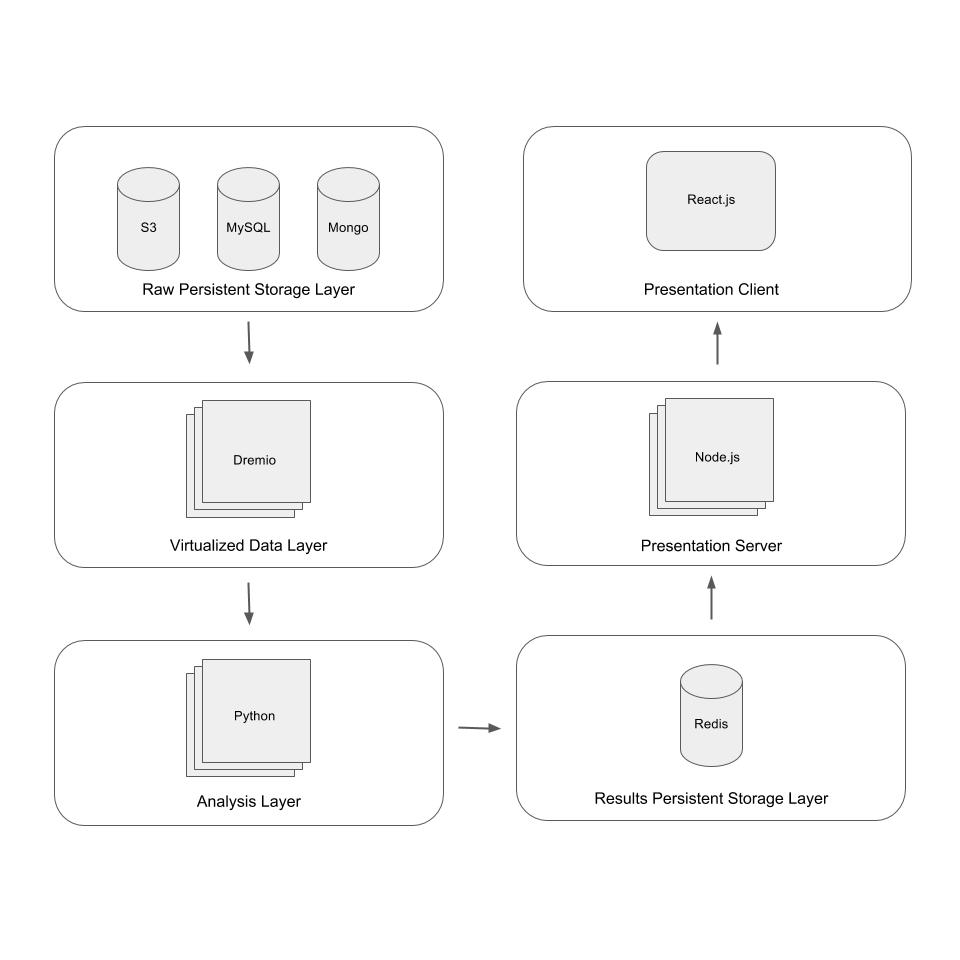

# Project Proposal

## Title

* **Name**: Cameron Porter

* **Class**: 2016

* **Title**: *Identification of United Kingdom Export Markets Post-Brexit via Systematic Weak Signal Analysis*

* **Advisors**: Christopher M. Moretti & Gregory E. van der Vink

## Motivation and Goal

* On June 23, 2016, in what has come to he known as the *Brexit Referendum*, the United Kingdom (UK) voted to leave the European Union (EU) [(HM Treasury, 5)](#treasury-brexit).

* The effect of Brexit on the UK's trade and economy is one of the most pressing debates as we approach the final day of UK's membership in the EU, March 29, 2019.

* There is a consensus in the academic community that in the long run, Brexit will have a negative effect on trade, although the extent of the effect is uncertain [(Sampson, 164)](#sampson-brexit).

* The purpose of this project is not to analyze the economics of Brexit.

* The purpose of this project is to design a systematic way of quantitatively analyzing potential markets for UK products in order to optimize the UK's Department of International Trade's effort to boost UK net trade in the face of a seemingly inevitable decline.

* Our goal is to design an automated *weak signal analysis* system, capable of dynamic data augmentation, for identifying markets for up to five UK products/services in the United States (US).

## Problem Background and Related Work

### Economics of Brexit

> Academics, private firms, and government agencies have weighed in on the economics of Brexit. Overall, the analysis focuses on two aspects of Brexit: what will be the macro level effects on the UK's economy, and what is the desired nature of relations between the EU and UK post Brexit.

* [(HM Treasury)](#treasury-brexit)

* [(Carl)](carl-brexit)

* [(Sampson)](#sampson-brexit)

* [IMG Forum Expert Panel Survey on Brexit I](http://www.igmchicago.org/surveys/brexit-2)

* [IMG Forum Expert Panel Survey on Brexit II](http://www.igmchicago.org/surveys/brexit-ii)

* In terms of small and medium size enterprises (SMEs), the UK's share of exports is in the bottom five across Europe [(WorldFirst, 5)](#worldfirst-brexit).

* One of the primary factors deterring UK SMEs from exporting is a sense that their product or service will not be suitable for a particular market [(WorldFirst, 6)](#worldfirst-brexit).

* Although it may be assumed that a weakening pound will increase exports, the global nature of UK supply chains combined with the potential for increased tariffs means exporters could become less competitive [(WorldFirst, 12)](#worldfirst-brexit).

* Due to the price inelasticity of UK goods and services abroad, quality and brand are two of the most important factors in determining SMEs' export success [(WorldFirst, 12)](#worldfirst-brexit).

* More than half of SME exports go to the US [(WorldFirst, 16)](#worldfirst-brexit).

* "SMEs in the IT and Communications sectors are much more likely to have plans to export (23% had such plans). Similarly, across the Professional and Scientific Service industries, 11% of SMEs said that they have such plans. This still leaves a considerable number of businesses across the UK with no intention to export" [(WorldFirst, 19)](#worldfirst-brexit).

### Market Segmentation

> *Market segmentation* describes the process of dividing potential consumers into particular groups based on shared characteristics. The characteristics shared by certain segments will make them in expectation a better *target market*. There are different types of market segmentation. Ours falls into the category of *geodemographic segmentation*. Our system can be considered a *geographic information system*.

* [(Grekousis)](#grekousis-segmentation)

* [Esri Demographics](http://www.esri.com/data/esri_data)

* [PSYTE HD: Market segmentation system for Canada](https://www.pitneybowes.com/us/data/demographic-data/psyte-hd-canada.html)

### Weak Signal Analysis

> There are *five V's* of big data: volume, velocity, variety, variability, and value [(Jain)](#jain-data). Weak signals are a phenomenon of ecosystems with many interacting parts. Observing these ecosystems and performing weak signal analysis requires ingesting diverse streams of data and then systematically looking at how these data streams interact with one another to produce strong predictive indicators. *Strong signals*, by contrast, arise from a single source. The result of our weak signal analysis will be a suite of indicators, no one of which is predictive of our desired output, but in combination provide valuable insight.

* [How to Make Sense of Weak Signals](http://sloanreview.mit.edu/article/how-to-make-sense-of-weak-signals/)

* [The strategic strength of weak signal analysis](http://www.sciencedirect.com/science/article/pii/S0016328711002564)

* [The strongness of weak signals: self-reference and paradox in anticipatory systems](https://link.springer.com/article/10.1007/s40309-016-0085-1)

## Approach

### Conceptual Framework

> This section describes the operating lense for this project, including the assumptions being made and theory behind our methodology.

* Our approach to identifying markets for UK products focuses on quantitative rigour and weak signal analysis to create ecosystem level insights.

* Quantitative rigour will be achieved by extracting salient features from data via established algorithms such as *Principle Component Analysis* (PCA) and *Non-Negative Matrix Factorization* (NMF). Clustering algorithms can also be used to identify interesting shared characteristics across markets. Using *correlation matrices* of these features with output variables, sets of features from disparate data sources can be integrated into a single indicator quantitatively.

* Unlike other methodologies that focus on the volume/value of data, we will be focusing on using data from a variety of sources (satellite imagery, amount of bike friendly lanes, number of Starbucks, average income, etc.). From this variety, we will inevitably find proxy measures that though not causal, are nonetheless predictive of what we are interested in.

* Much like in *ensemble learning* where a set of *weak learners* are used in conjunction to produce a strong model, we believe that by integrating weak signals from a variety of datasets, we can eliminate noise to capture subtle but powerful indicators. These indicators would otherwise be overlooked by methodologies not focused on the complex interplay that creates the salient characteristics of ecosystems.

* In order to effectively carry out this methodology, we must recognize that we are no longer data limited, but analysis limited. However since the methodology is quantitative, we can design systems to carry it out on our behalf.

* The system we design will have three key features.

  1. It must be able to operate on a variety of data sources simultaneously as if they were a single source.
  1. It must be able to carry out feature extraction and weak signal analysis.
  1. It must be able to dynamically integrate new data sources.

* Using a variety of data sources, weak signal analysis, and an automated system, we hope to be able to create heat maps identifying potential markets for UK products.

### Taxonomy

> This section lays out the components of our methodology in a schematic form.

### Algorithm

> This section describes the algorithm behind the methodology in mathematical form.

<!-- TODO: add SOM / MdPM here -->

## Plan

### Product/Service Selection

> In order to test our methodology, we have selected five UK products/services.

* In order to qualify for selection, these products/services must already be successfully exported to the US.

  * This may seem counterintuitive, but the purpose is to hone the focus of this project.

  * The goal of the project is to identify prime markets for UK products/services.

  * By restricting our selection to those already being exported to the US, we are mitigating the importance of other influential economic and political factors on export success.

    * These factors include quotas, tariffs, and regulatory compliance.

* We would also like to note our reasoning for selecting not only products, but services as well.

  * The purpose of the project is to boost UK's net trade.

  * This can be done by decreasing imports or increasing exports.

  * Since products are often made from imported components, the value in terms of net trade from exporting them is partially offset by the import cost of the components.

  * However, since services have no imported components, exporting them has a *purely* positive effect on net trade.

* For products already exported to the US via e-commerce, it is important that the benefits of a brick and mortar presence are clearly articulated.

  * Potential benefits include exposure in under penetrated markets and the ability to for potential consumers to test products

#### Brompton

> [Brompton](https://www.brompton.com/) is a bike company from London that has been manufacturing their signature foldable bike by hand since 1975. They have also recently produced an electric version of their popular bike.

#### Rapha

> [Rapha](http://www.rapha.cc/us/en_US/) is a British cycling gear company focused on high end, high performance products.

* [London Tea Company](https://www.londontea.co.uk/)

* [Anima Vinci](https://animavinci.com/)

* [London Distillery](https://www.londondistillery.com/story)

<!-- TODO: Brewery -->

<!-- TODO: IT Services https://dopay.com/ -->

<!-- TODO: Professional Service -->

<!-- TODO: Online educational services -->

### Datasets

> We have already identified a number of potential data sets from a variety of providers including, Princeton, Kaggle, Amazon, Uber, and the US Government. Each of these datasets has a location attribute. What follows is a selection of them.

#### Census

> Census data can provide demographic insights useful for geodemographic market segmentation.

* [Sage Stats](http://library.princeton.edu/resource/4453) is a collection of US state rankings on variety of topics.

* [American FactFinder](http://library.princeton.edu/resource/4640) combines data from the US decennial census, the American Community Survey, and more.

* [US Income Tax Data](https://www.kaggle.com/wpncrh/zip-code-income-tax-data-2014) provides data on the income by zip code.

* [US Permanent Visa Applications](https://www.kaggle.com/jboysen/us-perm-visas) provides data on where Visa applications originate.

* [IRS 990 Filings](https://aws.amazon.com/public-datasets/irs-990/) provides data on nonprofit tax filings.

* [Open Address](http://results.openaddresses.io/) provides street names, house numbers, and postal codes that can be combined with geographic coordinates.

* [World Cities Database](https://www.kaggle.com/max-mind/world-cities-database) provides data to convert country and city names to geographic coordinates.

* [Homlessness in the United States](https://www.kaggle.com/adamschroeder/homelessness) provides data on the rates of homelessness in cities.

#### Housing

> The cost of living is an important characteristic of populations.

* [Census of Population and Housing](http://library.princeton.edu/resource/5016) contains useful demographic information.

* [Zillow Rent Index](https://www.kaggle.com/zillow/rent-index) provides data on the median estimated monthly rental price for given areas.

* [AirBnB Listings](http://insideairbnb.com/get-the-data.html) provides data on neighborhoods and rental prices in select US cities.

* [US Gross Rent Statistics](https://www.kaggle.com/goldenoakresearch/acs-gross-rent-us-statistics) provides gross rent data across the US.

#### Trade

> US trade data can be useful in evaluating the effectiveness of our methodology.

* [Wiser Trade](http://library.princeton.edu/resource/4433) is an international trade database that provides data on U.S. exports and imports by customs district and port.

* [City Data](http://library.princeton.edu/resource/title/city-data) provides a city by city guide to product costs and business expenses.

#### Retail

> The retail stores already located in a given city can provide insights into the consumption preferences of the population.

* [Whole Foods](https://www.wholefoodsmarket.com/stores/list/state) is a high end grocery store whose locations tend to be in close proximity to affluent areas.

* [Starbucks Locations](https://www.kaggle.com/starbucks/store-locations) provides insight into the prevalence of Starbucks in US cities.

* [Breweries & Brew Pubs in the USA](https://www.kaggle.com/datafiniti/breweries-brew-pubs-in-the-usa) provides data on the location of breweries.

* [Restaurants on YellowPages.com](https://www.kaggle.com/PromptCloudHQ/restaurants-on-yellowpagescom) provides data on the type and quality of restaurants.

#### Culture

> We can attempt to quantify the culture of cities.

* [Museums, Aquariums, and Zoos](https://www.kaggle.com/imls/museum-directory) provides location data on these entertainment entities.

* [World University Rankings](https://www.kaggle.com/mylesoneill/world-university-rankings) provides data on the location of top universities.

* [TED Talk Locations](https://www.kaggle.com/rounakbanik/ted-talks) provides data on the location of TED events.

* [KickStarter](https://www.kaggle.com/socathie/kickstarter-project-statistics) provides data on where people who seek funding on the platform come from.

#### Energy

> The type and amount of energy consumed can be used to characterize cities.

* [United States Energy Census](https://www.kaggle.com/lislejoem/us_energy_census_gdp_10-14) provides data on the type and amount of energy for locations across the US.

#### Infrastructure

> The quality of infrastructure can provide insight into the cities priorities.

* [Hospital Ratings](https://www.kaggle.com/center-for-medicare-and-medicaid/hospital-ratings) provides data on the quality of health care.

#### Transportation

> Where people go and how they get there are important characteristics that distinguish populations.

* [Uber Movement Data](https://movement.uber.com/cities?lang=en-US) captures the movement patterns of cities around the world.

* [Move Hub Rankings](https://www.kaggle.com/blitzr/movehub-city-rankings) provides data on how easy it is to get around various cities.

* [Airport, Train Stations, and Ferry Terminals](https://www.kaggle.com/open-flights/airports-train-stations-and-ferry-terminals) provides data on the locations of transportation hubs in the US.

* [Amtrak](https://catalog.data.gov/dataset/amtrak-rail-stations-national) provides data on the location of Amtrak terminals.

* [Major Ports](https://catalog.data.gov/dataset/major-ports-national) provides data on the location of major ports in the US.

* [Freight Analysis Framework](https://catalog.data.gov/dataset/freight-analysis-framework-network-national) provides data for modeling freight in US.

* [Navigable Waterways](https://catalog.data.gov/dataset/navigable-waterway-nodes-national-national-geospatial-data-asset-ngda-waterway-nodes) provides data on the location of navigable waterways in the US.

#### Jobs

> Where people work is an important demographic characteristic.

* [Jobs on Naukri.com](https://www.kaggle.com/PromptCloudHQ/jobs-on-naukricom) provides job postings data.

* [US Jobs on Monster.com](https://www.kaggle.com/PromptCloudHQ/us-jobs-on-monstercom) provides job postings data.

#### Political

> Data on politicians, in particular concerning the orientation and the special interest groups they support, can provide useful insights into the nature of their constituency.

* [CQ Congress Collection](http://library.princeton.edu/resource/5062) is database containing roll call votes by topic and special interest group scores.

* [CQ Political MoneyLine](http://library.princeton.edu/resource/5082) provides data on the flow of money through the US political system.

### Indicators

> *Indicators* are arbitrary combinations of attributes from the physical datasets.

* Some example indicators could be "male population as a percentage of total population" or "number of Starbucks per kilometer".

* The indicators that we find most useful will most likely be ratios that adjust for population, gender disparity, income level, and education level.

* The development of indicators follows an exploratory. As we run our correlation analysis and discover relationships, we likely be inspired to create more indicators. The more indicators we create, the greater the potential for capturing the underlying relationships that drive ecosystem level insights.

* Indicators will be grouped into *buckets*. Some example buckets could be "health", "education", "economics", "infrastructure", "demographics", or "culture".

* Below is an example of a potential indicator's final metadata structure.

  * It should be noted that indicator naming conventions have not yet been established.

```json

{
  "description": "male population age 15-20 per square km (2015)",
  "abbreviation": "m_pop_15-20_per_km(2015)",
  "bucket": "demographics",
  "sources": ["US Census 2015"]
}

```

### System Architecture

> This distributed system will consist of six layers. There is one way data flow from the physical datasets to the UI the consumer interacts with. Each layer is responsible for one logical component in the data flow.



#### Raw Persistent Storage Layer

> The *raw persistent storage layer* is responsible for storing all of the raw data from the various sources listed above.

* This layer consists of many physical datasets in a variety of data sources. These data sources could include *S3*, *MySQL*, and/or *Mongo*. These can be local or cloud hosted.

* This collection of data is an asset on its own.

#### Virtualized Data Layer

> The *virtualized data layer* is responsible for providing an abstraction layer between the physical datasets and the *analysis layer*.

* Datasets will be *virtualized* using *Dremio's* open source software.

* These *virtual datasets* are the results of queries on the physical datasets as well as other virtual datasets. In all cases the dataset being queried is never modified.

* This layer will perform any data normalization and cleaning necessary for analysis.

* This layer of abstraction means that we gain the dual benefit of the physical datasets being an immutable source of truth and the ability to structure the data optimally for analysis.

* This layer will be where new indicators are created from the physical datasets. These indicators will be stored in a *space*, a logical grouping of virtual datasets in Dremio.

#### Analysis Layer

> The *analysis layer* is responsible for performing our weak signal analysis.

* This layer will be implemented in *Python*.

* This layer will include our custom weak signal analysis module.

* This layer will leverage such libraries as `pandas`, `numpy`, and `scikit-learn` to perform statistical analysis and machine learning.

* If neural networks are used, they will likely be implemented with `keras`.

* *Jupyter notebooks* will be used to initially explore and implement our methodology.

#### Results Persistent Storage Layer

> The *results persistent storage layer* is responsible for storing the output of our analysis so that it only has to be rerun when either new data is added or the methodology changed.

* The data will be stored with *Mongo* or *Redis*.

#### Presentation Server

> The *presentation server* will be responsible for providing the *presentation client* with access to the necessary data.

* This layer will be implemented with *Node.js*.

* In particular, this server will be a *GraphQL* server.

#### Presentation Client

> The *presentation client* will be responsible for displaying the relevant results and data to the end consumer.

* This layer will be implemented with *React.js*.

* This layer will take advantage of such libraries as `ArcGIS` to produce heat maps.

* This layer has the potential to leverage *self organizing maps* (SOMs).

  * A SOM is an unsupervised artificial neural network. SOMs are capable of working with high dimensional data to solve nonlinear problems such as feature extraction [(Kohonen)](#kohonen-soms).

  * SOMs can allow you to visualize high dimensional data in a lower dimensional space. We could thus use SOMs with our suite of indicators to produce visualizations that allow for consumers to have an intuitive understanding of the reasoning behind market recommendations.

  <!-- TODO: add notes on MdPM if used -->

## Evaluation

> There are two primary criteria for evaluating this project.

* To what extent are the indicators our methodology produces valuable in identifying potential markets for UK products in the US?

  * Backtesting could be used verify the value of the indicators we produce. This would require acquiring granular export data for one of the products/services. We could then analyze the correlation between our indicators and the success of a product/service in various markets.

* To what extent is the design of our systematic weak signal analysis flexible enough to be used to address different goals?

  * Answering this question will likely require a more qualitative analysis. Factors such as ease of integrating new datasets and ease of producing new indicators should be considered.

## Bibliography

* <a id='sampson-brexit' href='https://www.aeaweb.org/articles?id=10.1257/jep.31.4.163'>Sampson, Thomas. 2017. "Brexit: The Economics of International Disintegration". Journal of Economic Perspectives, 31(4): 163-84.</a>

* <a id='treasury-brexit' href='https://www.aeaweb.org/articles?id=10.1257/jep.31.4.163'>"HM Treasury analysis: the long-term economic impact of EU membership and the alternatives". London: HM Treasury, 2016. Print.</a>

* <a id='carl-brexit' href='https://www.aeaweb.org/articles?id=10.1257/jep.31.4.163'>Emmerson, Carl, et al. "Brexit and the UK's public finances". London: Institute for Fiscal Studies, 2016. Print.</a>

* <a id='grekousis-segmentation' href='http://www.sciencedirect.com/science/article/pii/S0143622811002256'>Grekousis, George, and Hatzichristos Thomas. "Comparison of Two Fuzzy Algorithms in Geodemographic Segmentation Analysis: The Fuzzy C-Means and Gustafson–Kessel  Methods." Applied Geography 34 (2012): 125-36. Web.</a>

* <a id='jain-data' href='https://www.ibm.com/blogs/watson-health/the-5-vs-of-big-data/'>Jain, Anil. "The 5 Vs of Big Data." Watson Health Perspectives. IBM, 07 June 2017. Web.</a>

* <a id='worldfirst-brexit' href=''>"Thinking Global: The Route to UK Exporting Success". WorldFirst. October 2016. Print.</a>

* <a id='kohonen-soms' href='http://www.springer.com/us/book/9783540679219'>Kohonen, Teuvo. Self-organizing maps. Berlin New York: Springer, 2001. Print.</a>

<a id='' href=''></a>
